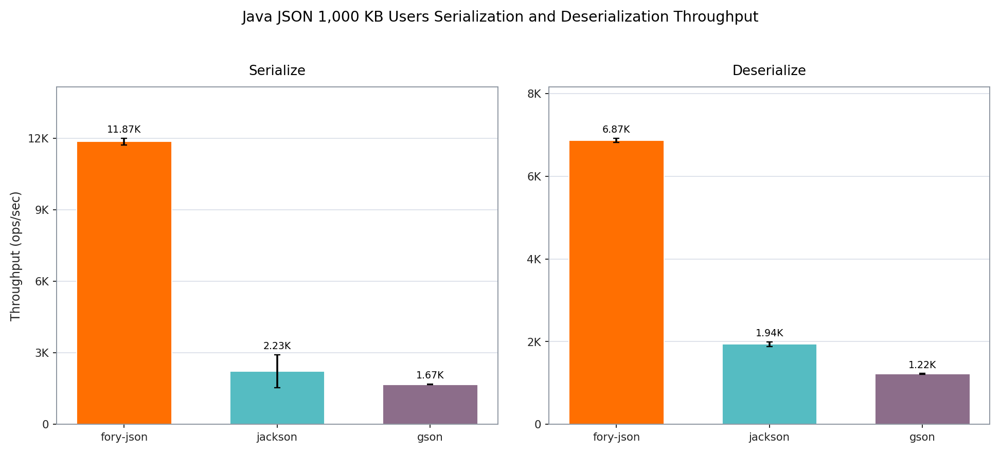
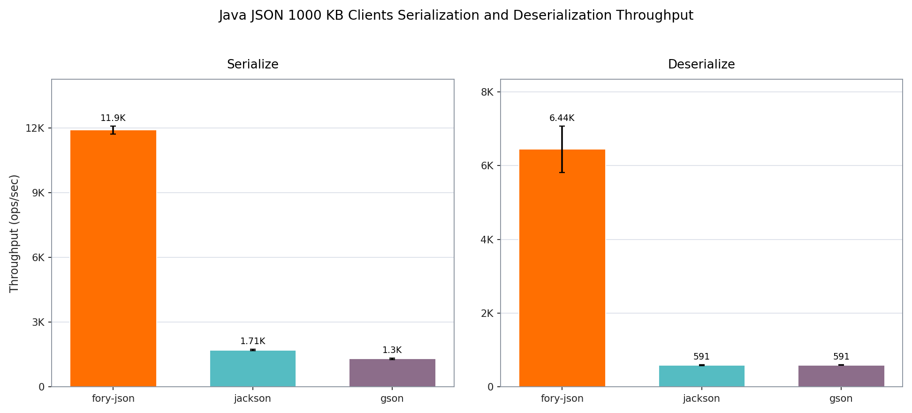
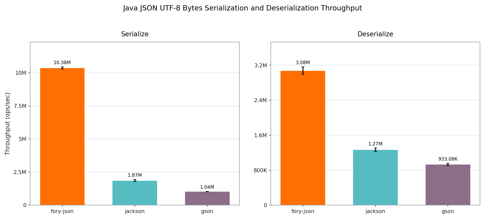

**TL;DR**: Apache Fory JSON is a high-performance Java framework for mapping application objects to standard JSON text and UTF-8 bytes. It supports ordinary Java models and runs on JDK 8+, Android, and GraalVM Native Image. In the published benchmark configurations below, Fory JSON is the fastest Java JSON serialization framework: up to **10.91× faster than Jackson and 10.89× faster than Gson** with 1000 KB payloads, and up to **5.55× faster than Jackson and 10.00× faster than Gson** in the `jvm-serializers` MediaContent benchmark.

- GitHub: [apache/fory](https://github.com/apache/fory)
- Documentation: [Fory JSON](/docs/json/)
- Wider 1000 KB benchmark context: [java-json-benchmark](https://github.com/fabienrenaud/java-json-benchmark/pull/129)


---

## JSON is still on the hot path

JSON is rarely the most interesting part of a Java service. It is simply everywhere: HTTP APIs, browser traffic, event envelopes, logs, configuration, and integrations with systems that do not share a binary protocol. That makes JSON processing a recurring CPU and allocation cost, often paid on every request.

Fory already provides compact binary object serialization and a cross-language protocol. Fory JSON tackles a different job. It maps Java objects to ordinary JSON text and UTF-8 bytes, so the result remains readable by browsers, command-line tools, and any standards-compliant JSON implementation.

There is no Fory-specific envelope and no binary metadata hidden in the document. This is standard JSON, built for Java applications that need to keep the wire format while spending less time converting it.

## A complete round trip

Fory JSON 1.6.0 is available from Maven Central:

```xml
<dependency>
  <groupId>org.apache.fory</groupId>
  <artifactId>fory-json</artifactId>
  <version>1.6.0</version>
</dependency>
```

Create one `ForyJson` instance and reuse it. The built instance is immutable and thread-safe.

```java
import org.apache.fory.json.ForyJson;

public final class JsonExample {
  private static final ForyJson JSON = ForyJson.builder().build();

  public static final class User {
    public long id;
    public String name;

    public User() {}

    User(long id, String name) {
      this.id = id;
      this.name = name;
    }
  }

  public static void main(String[] args) {
    User input = new User(7, "Alice");

    String text = JSON.toJson(input);
    byte[] utf8 = JSON.toJsonBytes(input);

    User fromText = JSON.fromJson(text, User.class);
    User fromUtf8 = JSON.fromJson(utf8, User.class);

    System.out.println(text);              // {"id":7,"name":"Alice"}
    System.out.println(fromText.name);      // Alice
    System.out.println(fromUtf8.name);      // Alice
  }
}
```

String and byte-array APIs are both first-class. For generic roots, a `TypeRef<List<User>>` keeps the element type available on reads and declared writes. Fory JSON can also write a complete UTF-8 document to an `OutputStream` without taking ownership of the stream.

## Where the speed comes from

Four implementation choices do most of the work.

**Minimal temporary allocation.** A `ForyJson` instance reuses prepared type metadata, execution state, and retained writer buffers. For most basic scalar values, the hot serialization path is effectively zero-allocation beyond the requested output: Fory writes the value directly into its output buffer instead of first converting it into a Java `String`. Returning a `String` or `byte[]` still creates that result, and buffer growth or a cold fallback can allocate.

**Highly optimized primitive writes.** Integers and longs use direct digit encoders, while floating-point values use direct formatting paths where the JDK provides them. Booleans, numbers, and quoted strings go straight to the active String or UTF-8 writer. There is no per-value `String.valueOf(...)` round trip on the hot path.

**Bulk memory operations.** Common Latin-1 and ASCII text is scanned and copied in 8-byte or 16-byte chunks. Generated writers can also use packed property prefixes and object framing, reducing per-character branches and repeated writes.

**Runtime code generation.** Fory JSON prepares a codec for each Java type it encounters. On a standard JDK, code generation and asynchronous compilation are enabled by default. Generated codecs specialize field access, property names, framing, and primitive operations for the target class instead of rediscovering the same property model on every call. An interpreted path remains available for restricted environments and diagnostics.

The public API preserves those fast paths. A service that already needs network bytes can call `toJsonBytes` and `fromJson(byte[], type)` directly, while text-oriented code can stay on the String path. Custom codecs also stream through Fory's reader and writer instead of building an intermediate JSON tree.

## The fastest Java JSON framework in these benchmarks

Any useful performance claim needs a workload. We use two views here: the three-thread `java-json-benchmark` run with one 1000 KB object per invocation, followed by the single-thread `jvm-serializers` MediaContent benchmark. Both report throughput in operations per second, so higher is better.

The tables compare Fory JSON only with Jackson and Gson. For the wider large-payload matrix, exact payload setup, and the benchmark integration, see [java-json-benchmark](https://github.com/fabienrenaud/java-json-benchmark/pull/129).

### `java-json-benchmark`: 1000 KB payloads

The 1000 KB suite asks what happens when each invocation has substantial parsing, traversal, and output work.

The 1000 KB run used Fory JSON 1.6.0, Jackson Databind 2.17.1, and Gson 2.11.0 with the databind API. JMH ran two forks and three threads. Each fork used five 3-second warmup iterations and five 3-second measurement iterations. The Users and Clients payloads each contained one 1000 KB object per invocation.





| Payload | Operation       | Fory JSON ops/s       | Jackson ops/s         | Gson ops/s            | vs. Jackson | vs. Gson |
| ------- | --------------- | --------------------: | --------------------: | --------------------: | ----------: | -------: |
| Users   | Serialization   | 11,867.566 ± 136.846  | 2,225.296 ± 687.106   | 1,674.083 ± 12.558    |       5.33× |    7.09× |
| Users   | Deserialization | 6,872.876 ± 46.998    | 1,940.172 ± 58.242    | 1,217.513 ± 12.358    |       3.54× |    5.65× |
| Clients | Serialization   | 11,895.269 ± 183.251  | 1,706.314 ± 36.263    | 1,298.288 ± 27.405    |       6.97× |    9.16× |
| Clients | Deserialization | 6,442.262 ± 627.116   | 590.656 ± 10.849      | 591.350 ± 6.444       |      10.91× |   10.89× |

Across these four large-payload cases, Fory JSON delivers 3.54× to 10.91× Jackson throughput and 5.65× to 10.89× Gson throughput.

### `jvm-serializers` MediaContent benchmark

The second view uses the [`jvm-serializers` MediaContent model](https://github.com/eishay/jvm-serializers/blob/master/tpc/src/data/media/MediaContent.java), which contains a media object and a list of images. This benchmark covers much smaller objects than the 1000 KB suite and separates Java String APIs from UTF-8 byte-array APIs.

The `jvm-serializers` benchmark ran on an Apple M4 Pro with JDK 26.0.1. It used one JMH fork and one thread, with three 2-second warmup iterations followed by five 2-second measurement iterations.




| Representation | Operation   | Fory JSON ops/s | Jackson ops/s | Gson ops/s | vs. Jackson | vs. Gson |
| -------------- | ----------- | --------------: | ------------: | ---------: | ----------: | -------: |
| String         | Serialize   |       7,387,465 |     2,049,368 |  1,084,042 |       3.60× |    6.81× |
| String         | Deserialize |       2,897,955 |     1,074,885 |    902,772 |       2.70× |    3.21× |
| UTF-8 bytes    | Serialize   |      10,375,498 |     1,868,614 |  1,037,211 |       5.55× |   10.00× |
| UTF-8 bytes    | Deserialize |       3,077,158 |     1,268,397 |    933,079 |       2.43× |    3.30× |

Fory JSON leads all four rows. Its largest advantage appears on UTF-8 serialization, where it passes 10 million operations per second and reaches 5.55× Jackson throughput and 10.00× Gson throughput.

The String and UTF-8 groups are deliberately separate. The String group excludes UTF-8 conversion. The byte group uses direct byte-array APIs where a library provides them; Gson includes its required String-to-byte and byte-to-String conversion.

Results vary by workload, but Fory JSON is the fastest framework in both benchmark configurations shown here.

## A fast path that still understands Java

Performance would be much less useful if it required flattening every application model into hand-written transfer objects. Fory JSON maps the Java shapes developers already use:

- ordinary mutable classes and inherited fields;
- Java records and immutable classes built through `JsonCreator`;
- generic collections and maps through `TypeRef`;
- Java time, optionals, atomics, UUIDs, paths, big numbers, enums, and common collection types;
- natural `JsonObject` and `JsonArray` trees when the target type is dynamic.

Property discovery can combine fields with JavaBean getters and setters, or switch to field-only mode. A finite `JsonSubTypes` table handles declared polymorphic models without accepting arbitrary class names from input.

## Annotations for real application models

Fory JSON provides its own annotations in `org.apache.fory.json.annotation`. They cover explicit property names and ordering, ignored directions, immutable construction, date and time formats, Base64 byte arrays, raw or complete value representations, flattened objects, dynamic members, validation, and finite subtype tables.

The annotation model will feel familiar to Jackson users, covering property names and ordering, creators, formatting, polymorphism, and validation. These are independent Fory JSON APIs, not Jackson-compatible annotations.

The annotations compose on an ordinary model. This event renames a fixed property, formats a date, flattens an owner, captures dynamic members, and validates the completed object after reading:

```java
import java.time.LocalDate;
import java.util.LinkedHashMap;
import java.util.Map;
import org.apache.fory.json.annotation.JsonAnyProperty;
import org.apache.fory.json.annotation.JsonFormat;
import org.apache.fory.json.annotation.JsonProperty;
import org.apache.fory.json.annotation.JsonUnwrapped;
import org.apache.fory.json.annotation.JsonValidator;

public final class Event {
  @JsonProperty("event_id")
  public long id;

  @JsonFormat(pattern = "dd/MM/uuuu")
  public LocalDate day;

  @JsonUnwrapped(prefix = "owner_")
  public Owner owner;

  @JsonAnyProperty
  public Map<String, Object> attributes = new LinkedHashMap<>();

  @JsonValidator
  public void validate() {
    if (id <= 0) {
      throw new IllegalArgumentException("event_id must be positive");
    }
  }

  public static final class Owner {
    public String name;
  }
}
```

`JsonCreator` supports immutable classes, while `JsonPropertyOrder` makes output order explicit. `JsonValue`, `JsonRawValue`, and `JsonBase64` handle specialized value shapes without changing the rest of the object mapping.

### Closed-world polymorphism with `JsonSubTypes`

`JsonSubTypes` maps a declared base type to a complete set of permitted implementations and logical names. The discriminator in JSON selects from this table; it never supplies a Java class name.

```java
import org.apache.fory.json.ForyJson;
import org.apache.fory.json.annotation.JsonSubTypes;

public final class PaymentExample {
  @JsonSubTypes(
      property = "kind",
      value = {
        @JsonSubTypes.Type(value = CardPayment.class, name = "card"),
        @JsonSubTypes.Type(value = BankTransfer.class, name = "bank_transfer")
      })
  public interface Payment {}

  public static final class CardPayment implements Payment {
    public String lastFour;
  }

  public static final class BankTransfer implements Payment {
    public String iban;
  }

  public static void main(String[] args) {
    ForyJson json = ForyJson.builder().build();

    CardPayment card = new CardPayment();
    card.lastFour = "4242";

    String text = json.toJson(card, Payment.class);
    Payment copy = json.fromJson(text, Payment.class);

    System.out.println(text);              // {"kind":"card","lastFour":"4242"}
    System.out.println(copy.getClass());   // class PaymentExample$CardPayment
  }
}
```

The declared-type write tells Fory JSON to use `Payment`'s subtype table. During reading, `kind` must match `card` or `bank_transfer`; an unknown name is rejected. For containers, a `TypeRef<List<Payment>>` carries the same declared base type for every element. The [annotations guide](/docs/json/annotations) covers the alternative wrapper representations and complete validation rules.

For a third-party type that cannot carry annotations, a Mixin overlays the same Fory JSON annotations without changing or wrapping the target class:

```java
import org.apache.fory.json.ForyJson;
import org.apache.fory.json.annotation.JsonMixin;
import org.apache.fory.json.annotation.JsonProperty;

@JsonMixin(target = ThirdPartyUser.class)
abstract class ThirdPartyUserMixin {
  @JsonProperty("user_id")
  long id;
}

ForyJson json =
    ForyJson.builder()
        .registerMixin(ThirdPartyUserMixin.class)
        .build();
```

When annotations are not enough, `JsonValueCodec<T>` owns one complete JSON value and streams it through Fory's reader and writer. Child codec selections can customize collection elements, optional contents, and map keys or values without replacing the surrounding container mapping.

## JDK, Android, and native executables

The same `fory-json` artifact supports Java 8 and later. Java records require Java 17 or later.

On Android API level 26+, Fory JSON automatically uses interpreted object mapping because runtime compilation is unavailable. The Fory annotation processor can generate direct model access and exact R8 rules for `JsonType` classes and Mixins.

GraalVM Native Image has its own build-time integration. Mark reachable models with `JsonType` for prepared access metadata. If a particular completed `ForyJson` configuration should use generated codecs in the native executable, expose it from a reachable `ForyJsonProvider`; other prepared configurations continue to work with interpreted codecs.

This gives applications one mapping model across a normal JVM, Android, and native executables without pretending those runtimes have the same code-generation capabilities.

## Security controls for untrusted JSON

A fast parser still needs a strict type boundary. Fory JSON deserializes into the type declared by the application; JSON input cannot select an arbitrary Java class. Polymorphism is closed-world: a `JsonSubTypes` declaration defines the complete finite set of permitted subtypes, and input can select only a logical name from that table. Fory JSON also applies a fixed type disallow list and provides `JsonTypeChecker` for application-defined allow-lists. Together, these controls prevent untrusted JSON from materializing arbitrary classes through open-world polymorphic deserialization.

Input depth defaults to 20. A separate graph-memory budget defaults to 128 MiB per root read and estimates the retained object graph created by arrays, collections, maps, records, and application objects. `JsonValidator` methods can enforce domain rules after a mapped object is complete.

Those controls do not replace HTTP body limits, authentication, authorization, timeouts, or endpoint-specific validation. They give the JSON layer clear boundaries to combine with those external controls. The [Fory JSON security guide](/docs/json/security) documents the accounting model and recommended negative tests.

## Choosing the right Fory format

Choose Fory JSON when the wire must remain ordinary JSON: public APIs, browser clients, configuration, logs, or an integration that already speaks JSON. You get the interoperability of the format with a Java implementation designed around generated codecs and reusable state.

Choose Fory's binary object serialization when both sides can use a binary protocol and the application needs features JSON does not carry, such as cross-language schema metadata, shared-reference identity, or circular object graphs. The two formats solve different problems and can live in the same service.

## Start here

The fastest route to a useful evaluation is to replace one representative Jackson or Gson round trip, reuse a single `ForyJson` instance, and benchmark the application's real model and JDK settings. The published numbers show the available headroom; the application workload tells you how much of it matters.

- Read the [Fory JSON overview](/docs/json/).
- Run the [Getting Started example](/docs/json/getting-started).
- Inspect the [complete `jvm-serializers` MediaContent benchmark](/docs/benchmarks/json/java/).
- Review the [1000 KB benchmark and broader matrix](https://github.com/fabienrenaud/java-json-benchmark/pull/129).
- Join development at [apache/fory](https://github.com/apache/fory).

Fory JSON keeps the format everyone already understands. The difference is how little time your Java service has to spend on it.
