> **Note**: Different serializers and configurations excel in different workloads. Benchmark results are for reference only.
> For your specific use case, conduct benchmarks with appropriate configurations and workloads.

## Java Benchmark

The Java benchmark section compares Fory against popular Java serialization frameworks using the current benchmark suite from `docs/benchmarks/object-serialization/native/java`.

**Serialization Throughput**:

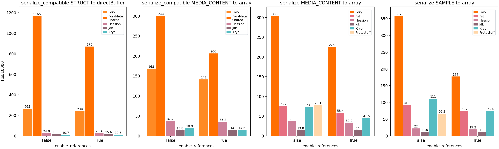

**Deserialization Throughput**:

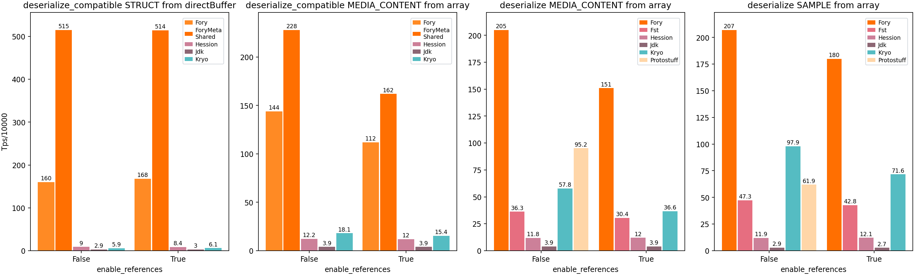

**JSON Throughput**:

  
  

**Cross-Language Throughput**:

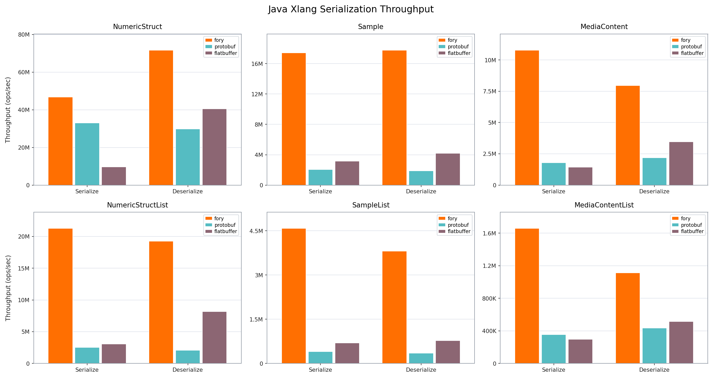

**Important**: Fory's runtime code generation requires proper warm-up for performance measurement:

For additional benchmark notes, raw data, and the complete Java benchmark README, see [Java Benchmarks](object-serialization/native/java/README.md).

## Python Benchmark

Fory Python demonstrates strong performance compared to `pickle` and Protobuf across object and list workloads.

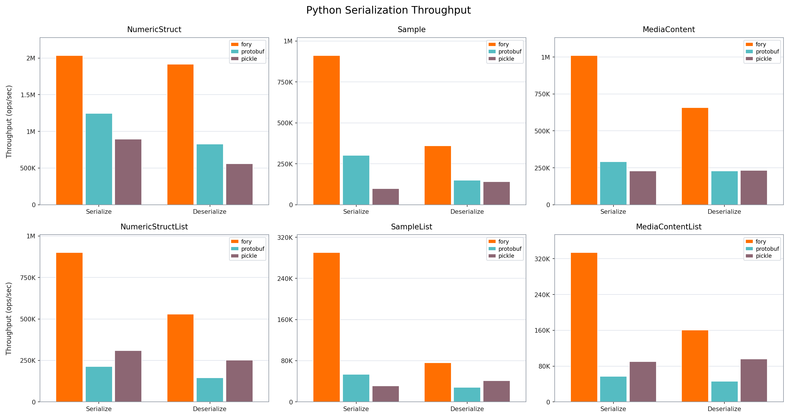

For benchmark setup, raw results, and reproduction steps, see [Python Benchmarks](object-serialization/xlang/python/README.md).

## Rust Benchmark

Fory Rust demonstrates competitive performance compared to other Rust serialization frameworks.

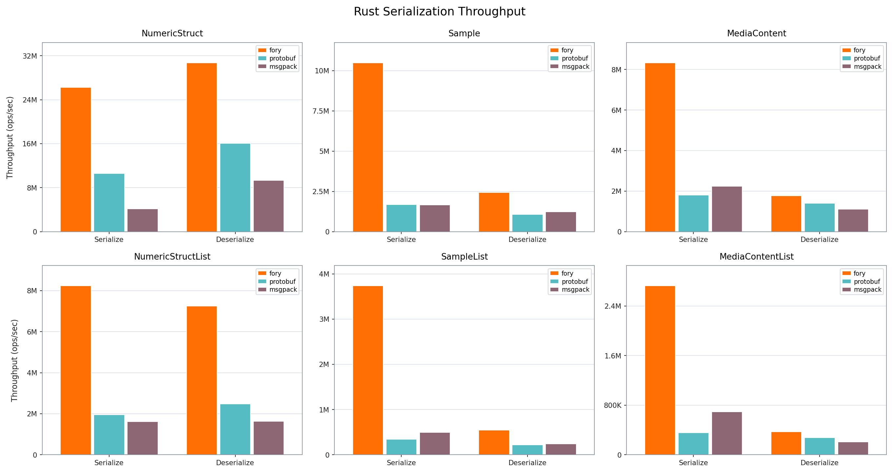

Note: Results depend on hardware, dataset, and implementation versions. See the
[Rust benchmark report](object-serialization/xlang/rust/README.md) for the recorded environment,
workloads, and reproduction command.

## C++ Benchmark

Fory C++ demonstrates competitive performance compared to Protobuf C++ serialization framework.

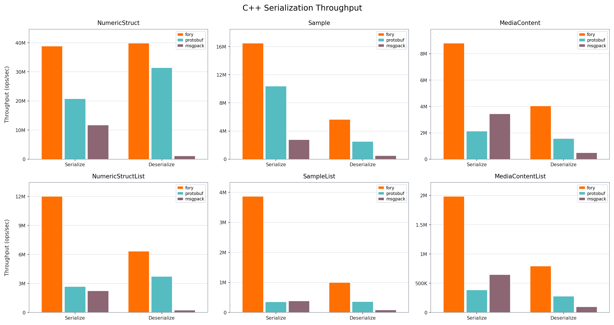

See the [C++ benchmark report](object-serialization/xlang/cpp/README.md) for the recorded
environment, workloads, and reproduction command.

## Go Benchmark

Fory Go demonstrates strong performance compared to Protobuf and Msgpack across
single-object and list workloads.

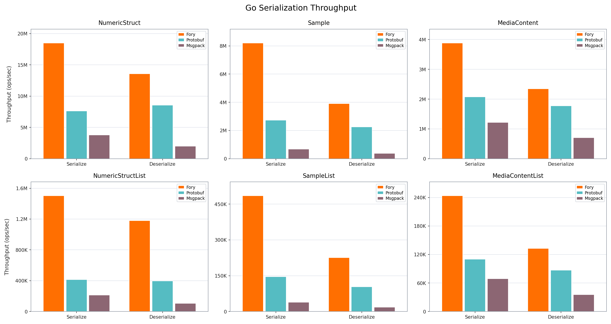

Note: Results depend on hardware, dataset, and implementation versions. See the
[Go benchmark report](object-serialization/xlang/go/README.md) for details.

## C# Benchmark

Fory C# demonstrates strong performance compared to Protobuf and Msgpack across
typed object serialization and deserialization workloads.

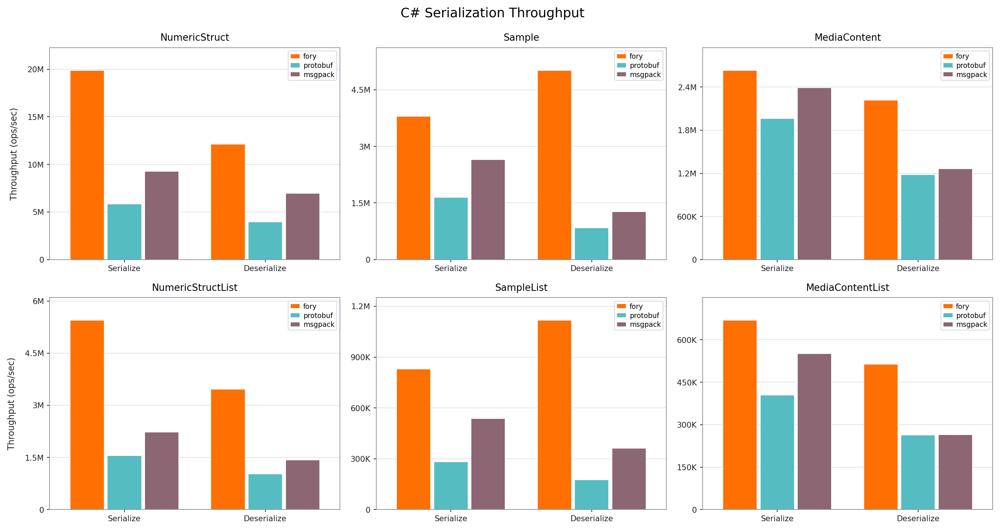

Note: Results depend on hardware and runtime versions. See the
[C# benchmark report](object-serialization/xlang/csharp/README.md) for details.

## Swift Benchmark

Fory Swift demonstrates strong performance compared to Protobuf and Msgpack
across both scalar-object and list workloads.

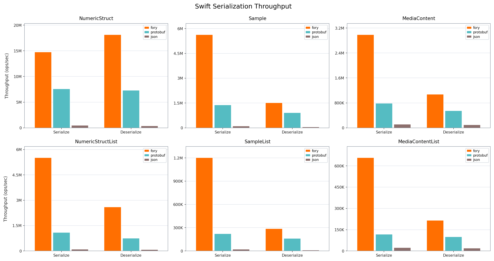

Note: Results depend on hardware and runtime versions. See the
[Swift benchmark report](object-serialization/xlang/swift/README.md) for details.

## JavaScript Benchmark

Fory JavaScript demonstrates strong performance compared to Protocol Buffers and
JSON across representative Node.js workloads.

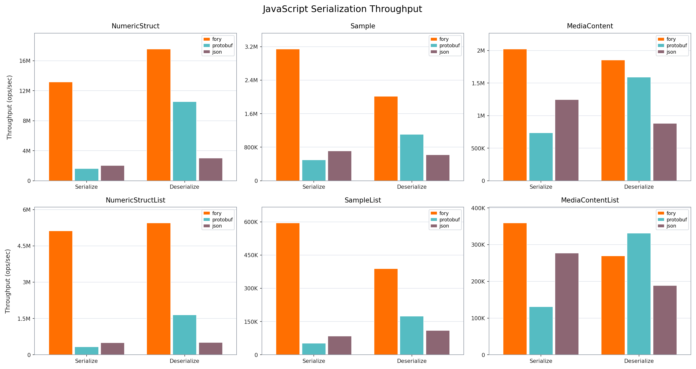

Note: Results depend on hardware, dataset, and runtime versions. See the
[JavaScript benchmark report](object-serialization/xlang/javascript/README.md) for details.

## Dart Benchmark

Fory Dart demonstrates strong performance compared to Protocol Buffers across
representative object and list workloads.

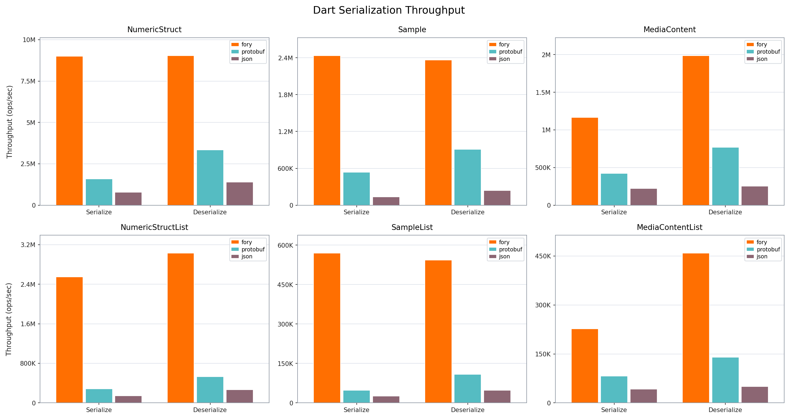

Note: Results depend on hardware, dataset, and runtime versions. See the
[Dart benchmark report](object-serialization/xlang/dart/README.md) for details.

## Read Results Responsibly

Start with [Methodology](methodology.md), then open the report whose capability, language, schema,
mode, and operation match your workload. The checked-in results are historical evidence from their
recorded environment, not a guarantee for a different application or current main branch.
