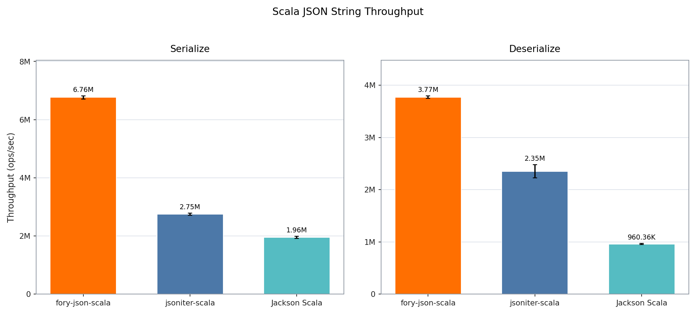
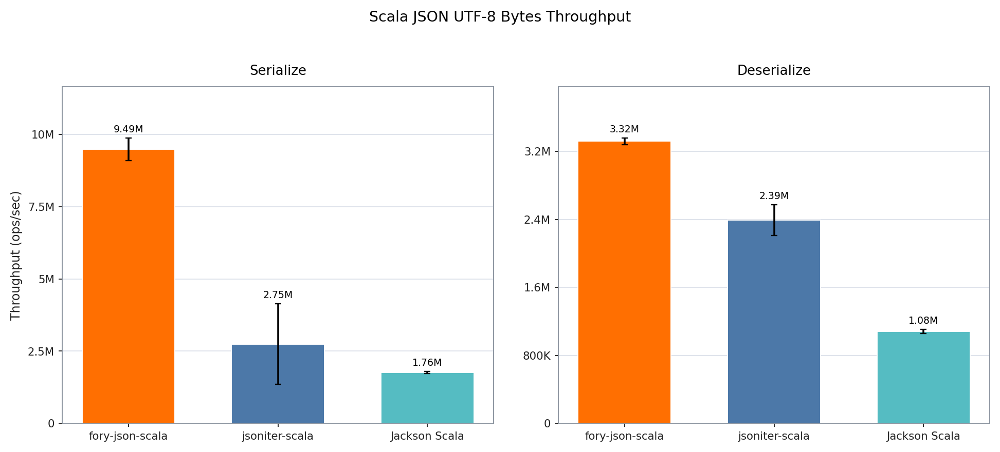

# Scala JSON Benchmark Report

The benchmark compares fory-json-scala, jsoniter-scala, and Jackson Scala on the same immutable Scala MediaContent model and Eishay JSON document. The String group excludes UTF-8 conversion; every library in the UTF-8 group uses its direct byte-array API.

- Benchmark date: `2026-08-14`
- Source commit: `588ad6ab355c4c23fa0a2e4f269a8c733cba7b01`
- Platform: macOS-15.7.2-arm64-arm-64bit (arm64)
- JDK: `26.0.1`
- VM: `OpenJDK 64-Bit Server VM`
- JMH: `1.37`
- Warmup: 2 iterations × `1 s`
- Measurement: 2 iterations × `1 s`
- Forks: 1; threads: 1
- Aggregation: median of 3 alternating short runs; error bars show the maximum cross-run deviation
- Mode: throughput; higher is better

## String

## UTF-8 Bytes

## Results

| Representation | Operation   | fory-json-scala ops/sec | jsoniter-scala ops/sec | Jackson Scala ops/sec | Fastest         |
| -------------- | ----------- | ----------------------: | ---------------------: | --------------------: | --------------- |
| String         | Serialize   |               6,760,588 |              2,748,997 |             1,955,855 | fory-json-scala |
| String         | Deserialize |               3,771,280 |              2,350,297 |               960,362 | fory-json-scala |
| UTF-8 bytes    | Serialize   |               9,485,122 |              2,745,567 |             1,761,719 | fory-json-scala |
| UTF-8 bytes    | Deserialize |               3,318,893 |              2,391,923 |             1,080,453 | fory-json-scala |

## Fory performance advantage

| Representation | Operation   | vs jsoniter-scala | vs Jackson Scala |
| -------------- | ----------- | ----------------: | ---------------: |
| String         | Serialize   |            145.9% |           245.7% |
| String         | Deserialize |             60.5% |           292.7% |
| UTF-8 bytes    | Serialize   |            245.5% |           438.4% |
| UTF-8 bytes    | Deserialize |             38.8% |           207.2% |
